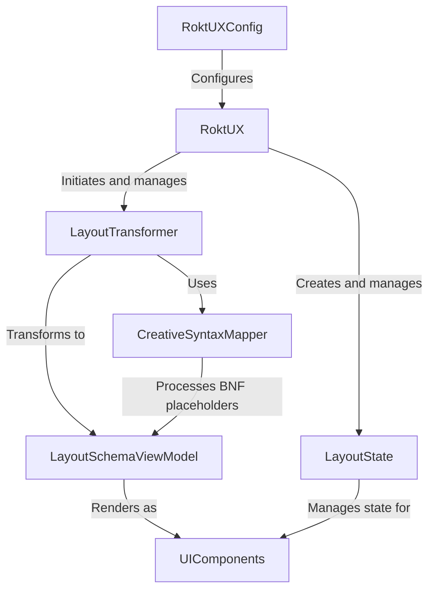

# Rokt UX Helper iOS

The RoktUXHelper enables partner applications to render tailored user experiences, improving the velocity of testing and relevancy for the customer. This library offers an easy way to perform rendering and provides event hooks for integration into backend systems.

## Resident Experts

- James Newman - <james.newman@rokt.com>
- Thomson Thomas - <thomson.thomas@rokt.com>

| Environment | Build                                                                                                                                                                                     | Coverage                                                                                                                                    |
| ----------- | ----------------------------------------------------------------------------------------------------------------------------------------------------------------------------------------- | ------------------------------------------------------------------------------------------------------------------------------------------- |
| main        | [](https://github.com/ROKT/rokt-ux-helper-ios/actions/workflows/pull-request.yml) | [](https://codecov.io/gh/ROKT/rokt-ux-helper-ios) |

## Requirements

- Download the latest [Xcode](https://developer.apple.com/xcode/). Project is configured to run on iOS 15.0 and above and compiled with the latest version of iOS.
- clone the repository using `git clone git@github.com:ROKT/rokt-ux-helper-ios.git`

## Installation

### Swift Package Manager

#### Xcode

To integrate to your Xcode project, select File > Add Package Dependency and enter
`https://github.com/ROKT/rokt-ux-helper-ios`.
You can also navigate to your target's General pane, and in the "Frameworks, Libraries, and Embedded Content" section, click the + button, select Add Other, and choose Add Package Dependency.

#### Swift package

To integrate to your Swift package, add the following SPM dependency into your `Package.swift` file. This configuration ensures that your app will receive updates to the library up to, but not including, the next major release.

```swift
dependencies: [
    .package(url: "https://github.com/ROKT/rokt-ux-helper-ios.git", .upToNextMajor(from: "0.1.0"))
]
```

### CocoaPods

Add the following to your `Podfile`:

```ruby
pod 'RoktUXHelper', '~> 0.8'
```

Then run `pod install`.

## Architecture



The RoktUX Helper iOS follows a unidirectional data flow architecture with these key components:

- **RoktUX**: The main entry point that orchestrates the rendering process and manages the overall state
- **LayoutTransformer**: Converts layout schema from backend responses into view models
- **CreativeSyntaxMapper**: Processes BNF (Backus-Naur Form) placeholders in layout content, transforming them into the final display values
- **LayoutSchemaViewModel**: Represents the UI structure in a framework-agnostic way
- **LayoutState**: Maintains the state of UI components and handles user interactions
- **UIComponents**: The actual UI components rendered on screen (compatible with both SwiftUI and UIKit)

Data flows from the backend response through the transformer and creative mapper to create view models with resolved placeholders, which are then rendered as UI components. User interactions flow back through the state management system to trigger callbacks and state updates.

## Opening the Project

Open the `Package.swift` file with Xcode to start development.

### How to run unit tests locally?

Press `command + U`, or `Product -> Test` from the menu bar.

## Snapshot Testing

Component tests use [swift-snapshot-testing](https://github.com/pointfreeco/swift-snapshot-testing) to catch visual regressions. Each snapshot test renders a component via `UIHostingController` and compares the result pixel-by-pixel against a committed reference PNG.

All snapshot tests share a single device config (`snapshotDevice` in `Tests/.../UI/Utils/SnapshotConfig.swift`) so the viewport is consistent. CI runs these alongside unit tests and uploads failure diffs as a `snapshot-failures` build artifact when any test fails.

**Current snapshot coverage:**

- `TestBasicTextComponent/testSnapshot` -- BasicText with font, color, background, fixed height
- `TestColumnComponent/testSnapshot` -- Column with background and centered child
- `TestRichTextComponent/testSnapshot` -- RichText with HTML bold/italic/underline/strikethrough
- `TestRichTextComponent/testSnapshot_nilDefaultStyle` -- nil `defaultStyle` regression guard
- `TestRichTextComponent/testSnapshot_nilTextStyle` -- nil text style font-stripping guard
- `TestRowComponent/testSnapshot` -- Row with background and BasicText child
- `TestRowComponent/testSnapshot_withChildren` -- Row with multiple children
- `TestScrollableColumn/testSnapshot` -- ScrollableColumn wrapping a styled Column
- `TestZStackComponent/testSnapshot` -- ZStack with background and centered alignment
- `TestCreativeResponseComponent/testSnapshot` -- Positive creative response button
- `TestToggleButtonComponent/testSnapshot` -- ToggleButton default state

See [TESTING.md](./TESTING.md) for the full coverage matrix including known gaps.

**Workflow:**

1. **First run** -- no reference image exists; the library records one and fails. Review the PNG, then commit it.
2. **Subsequent runs** -- rendered output is compared against the reference. Any pixel difference fails the test.
3. **Intentional UI changes** -- if your code change intentionally alters component appearance, snapshot tests will fail. Delete the old PNGs from `__Snapshots__/`, re-run to re-record, visually inspect, and commit the updated images with your PR. See [TESTING.md](./TESTING.md) for the full step-by-step process.
4. **CI failures** -- download the `snapshot-failures` artifact from the Actions run to inspect the actual vs. expected diff.

Reference images live at:

```text
Tests/RoktUXHelperTests/UI/Components/__Snapshots__/<TestClass>/<testMethod>.1.png
```

For a detailed guide on adding new snapshots, see [TESTING.md](./TESTING.md).

## Key Dependencies & Gotchas

### SDK Dependencies

- **DcuiSchema**: Core library for parsing experience response. Any schema changes require careful testing to ensure compatibility.
- **ViewInspector**: Used only for testing - not included in production builds.

### Integration Gotchas

1. **iOS Version Compatibility**: The library requires iOS 15.0+. Using with earlier iOS versions will not render any layouts.

2. **Error Handling**:
   - Schema parsing errors are handled gracefully but may result in empty views

### How to Update the Layouts Schema File

1. Ensure the Swift version of SSOT has been released in [DCUI-Schema-Repo](https://github.com/ROKT/dcui-layout-schema)
2. Update dcui-swift-schema dependency version in package.swift to the latest version
   `.package(url: "https://github.com/ROKT/dcui-swift-schema.git", exact: "x.y.z"),`
3. Update `Constants.layoutSchemaVersion` in `Sources/RoktUXHelper/Data/Model/RoktIntegrationInfoDetails.swift` to match the same `x.y.z`. `SchemaVersionConsistencyTests` fails the build if these two values drift.
4. Verify `schema.swift` is updated

## Example App

An example app is available in this repository to demonstrate integration with RoktUXHelper using both SwiftUI and UIKit. For detailed implementation examples, refer to the [example app README](https://github.com/ROKT/rokt-ux-helper-ios/tree/main/Example).

## FAQ

### 1. Documentation

For detailed documentation, check the [SwiftUI integration guide](https://docs.rokt.com/server-to-server/ios?platform=swiftui) and [UIKit integration guide](https://docs.rokt.com/server-to-server/ios?platform=uikit).

### 2. What are the branches?

There are main branches coresponding to each version : **Main**, **Release branches** and **Features branches**

- **main** - This is the main, default branch. Feature branches merge back into this branch, and release branches are created off this branch.
- **release branches** - This branch is production ready.
- **feature branches** - After every push to this branch swift lint and tests are run to ensure no breaking changes are allowed.

## Creating a Release

To create a new release version:

1. Navigate to the "Actions" tab in the GitHub repository
2. Select the "Release – Draft" workflow
3. Click "Run workflow" and use the dropdown to bump the version
4. Click "Run workflow" to start the process

This workflow will:

- Create a release PR with the specified version allowing you to review
- Auto-generate changelog from git history (conventional commit PR titles)

> [!NOTE]
> The "Release – Draft" workflow maintains the `VERSION` file and `CHANGELOG.md` automatically. **Do not edit `CHANGELOG.md` in feature branches** — entries are generated from conventional commit PR titles at release time and any manual edits will be overwritten. See [RELEASING.md](./RELEASING.md) for details.
